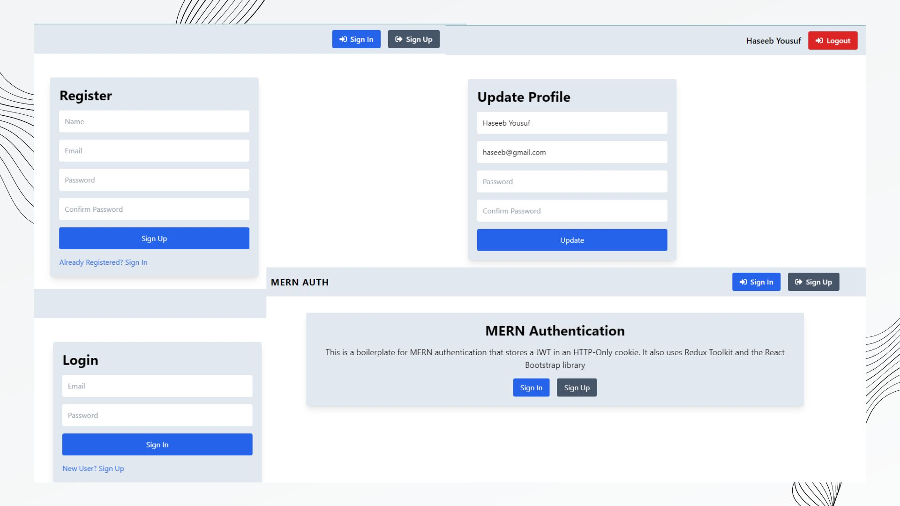

# MERN AUTH

This is a MERN stack application with authentication using `JWT` and `HTTP-Only Cookie`. This is for a SPA (Single Page Application) workflow that uses the Vite Build tool.

## Screenshots

## Features

- Backend API with Express & MongoDB
- Routes for auth, logout, register, profile, update profile
- JWT authentication stored in HTTP-only cookie
- Protected routes and endpoints
- Custom middleware to check JSON web token and store in cookie
- Custom error middleware
- React frontend to register, login, logout, view profile, and update profile
- Tailwindcss
- React Toastify notifications
